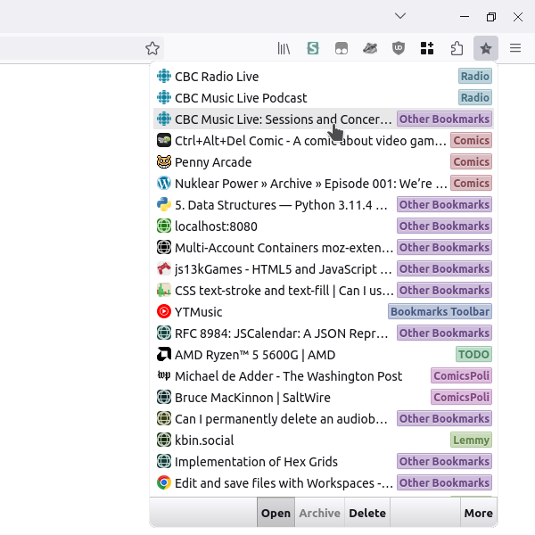
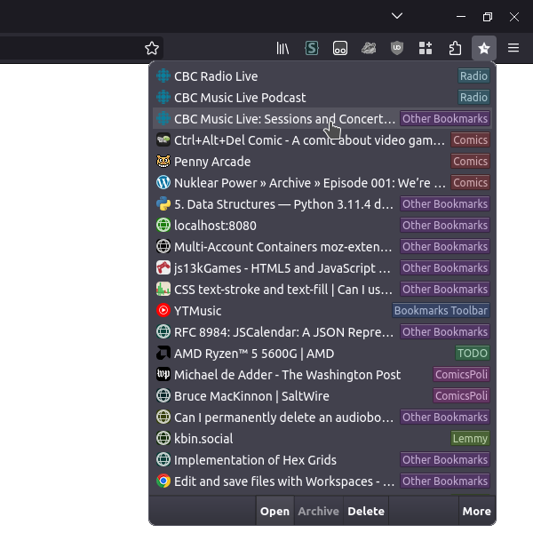
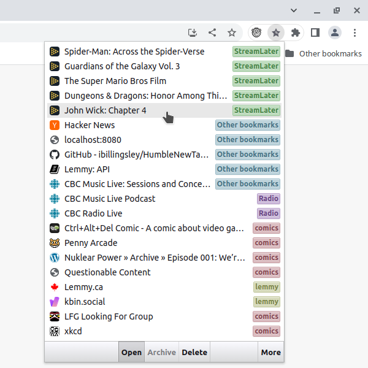
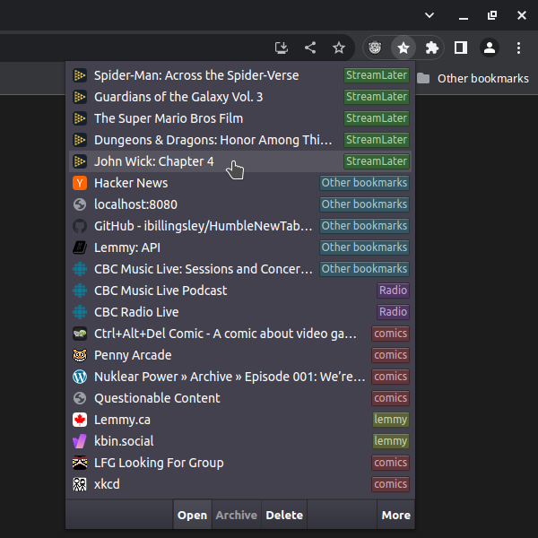
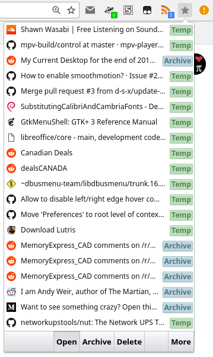

# Recent Bookmarks

This is a very simple extension that lists the most recent bookmarks.

* **Chrome:** https://chrome.google.com/webstore/detail/recent-bookmarks-popup/pdgbmlhjjgaenhbmahiafcelnbbbopla
* **Firefox:** https://addons.mozilla.org/en-CA/firefox/addon/recent-bookmarks-popup/

* Shows a tag with the parent folder name.
* Can easily delete multiple recent bookmarks.
* Can quickly move a bookmark to an "Archive" folder (name is case sensitive).
* In the options page, you can toggle grouping bookmarks by date, or hide the bottom toolbar.

## Permissions

* **Chrome:** Favicons are displayed using the favicon cache.
* **Firefox:** Since firefox doesn't expose the favicon cache, the extension needs to do it manually. By using the `tabs` permission, it can store the favicons when you visit a site. Until you have visited a bookmark, a color will be generated for the website based on the hostname.

## Screenshots

Older screenshot, but demonstrates Archive folder.

## Develop / Build

Run `sh ./build.sh` to generate a `firefox.xpi` and a `chrome.crx`.

You can easily load the `src/` as an unpacked addon in Firefox and Chrome with a few warnings.

To properly test Firefox or Chrome without warnings, you will need to modify the `manifest.json` before loading it as an unpacked extension. First run `python3 preparebuild_chrome.py` to modify the `manifest.json`.

Run `git checkout src/manifest.json` to reset the file before commiting changes with it.

